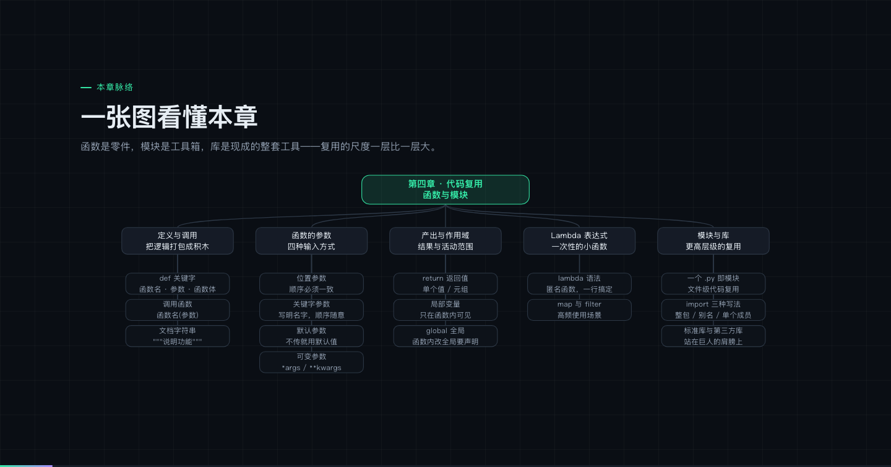
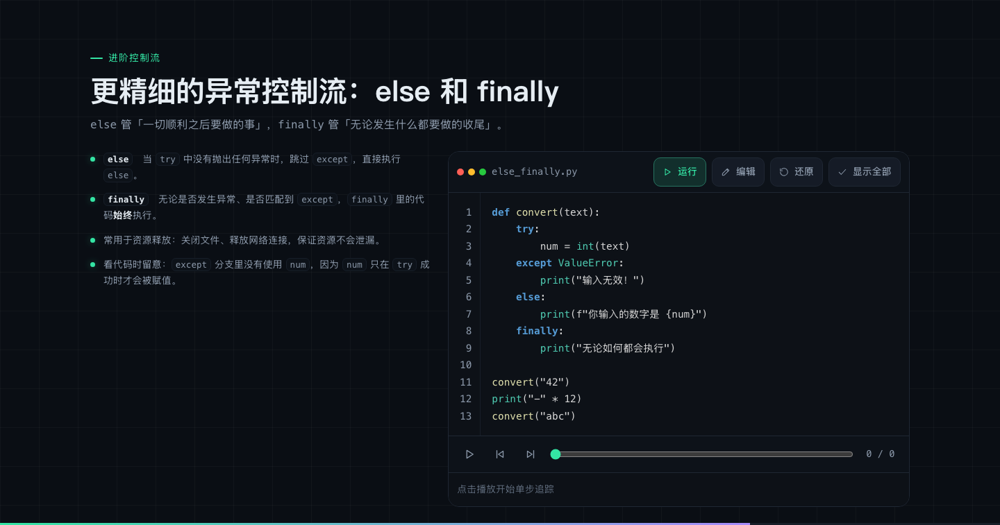

# Python 入门教程（网页版）

把一套七章的中文 Python 课件，做成了**可交互的网页教程**。

代码不是截图——**在浏览器里真实运行的 Python**，可以随手改、随手跑。



---

## 它有什么不一样

**代码真的能跑。** 内置 [Pyodide](https://pyodide.org/)（CPython 编译成 WebAssembly），
51 个代码示例全部可在页面上直接执行，还能改。不是"预期输出"写在那里给你看。

**完全离线。** 运行时连同 numpy、pandas、matplotlib 一起内置（约 32MB），
断网也能跑代码，适合没有网络的教室。

**讲师讲稿没丢。** 原 PPT 里 111 页的演讲者备注被完整保留，
按 <kbd>S</kbd> 就能调出讲师讲解。

**关键概念配了单步追踪。** 循环怎么一轮轮跑、异常怎么被捕获——
可以像调试器一样一步步看行号高亮和变量变化。



还有：翻页动画（连按方向键不卡不乱）、明暗双主题、手机窄屏重排、
课堂讲授 / 课后自学双模式。

---

## 课程内容

| # | 章节 | 页数 | 主要内容 |
|---|---|---|---|
| 1 | 变量与基本运算 | 10 | 数据类型、变量与赋值、运算符体系 |
| 2 | 控制逻辑流 | 16 | if / elif / else、for / while、推导式与嵌套 |
| 3 | 组合数据容器 | 16 | 列表、元组、字典、集合、浅拷贝与深拷贝 |
| 4 | 代码复用 | 18 | 函数与参数、作用域、返回值和 Lambda、模块与 import |
| 5 | 标准库与第三方库 | 19 | os / sys / math / random / datetime / json / re、pip、numpy / pandas / matplotlib |
| 6 | 文件读写与异常 | 17 | open 与 with、try / except / else / finally、健壮的文件处理 |
| 7 | 面向对象 | 17 | 类与对象、属性与方法、封装 / 继承 / 多态 |

共 **7 章 113 页**，54 个代码示例。

---

## 快速开始

```bash
git clone <this-repo>
cd <repo>
python3 serve.py
```

浏览器会自动打开 <http://localhost:8000>。

> `serve.py` 只做三件事：起静态服务、给 `.mjs` / `.wasm` 正确的 MIME 类型、
> 给内置运行时加长缓存。用任何静态服务器都可以。

### 操作方式

| 按键 | 功能 |
|---|---|
| <kbd>←</kbd> <kbd>→</kbd> / <kbd>空格</kbd> | 翻页（也支持触屏滑动、点击左右边缘） |
| <kbd>O</kbd> | 本页总览，点击跳转 |
| <kbd>S</kbd> | 讲师讲解抽屉 |
| <kbd>F</kbd> | 全屏，适合投影 |
| <kbd>Ctrl</kbd>+<kbd>Enter</kbd> | 编辑代码时运行 |

代码区按钮：**运行** · **编辑** · **还原** · **显示全部**（跳过打字机动画）。

---

## 技术说明

原生 HTML / CSS / JavaScript，**零构建、零依赖**（Pyodide 已内置在仓库里）。
改完直接刷新，不需要编译。

```
├── index.html              课程首页
├── chapter.html            章节页（?ch=N，七章共用一套引擎）
├── serve.py                本地服务器
├── assets/
│   ├── css/                设计令牌、幻灯片布局、代码样式、动画、响应式
│   ├── js/                 翻页引擎、渲染器、高亮器、运行器、追踪播放器
│   ├── data/               各章内容（ch1.js … ch7.js）
│   └── vendor/pyodide/     Python 运行时（离线内置）
├── docs/                   预览图与详细说明
└── tools/                  仅开发期使用
```

几个值得一提的实现选择：

- **翻页用 Web Animations API 而非 CSS transition**。CSS transition 无法干净地中途取消，
  快速连按方向键会动画打架；WAAPI 的 `cancel()` / `commitStyles()` 可以做「最新一次导航胜出」。
- **代码执行放在 Web Worker 里**。学员可以改代码，写出 `while True:` 时主线程方案会整页卡死；
  Worker 能直接 `terminate()` 重建（实测约 1 秒），页面始终可用。
- **语法高亮与打字动画分离**：先一次性把源码切准并高亮，动画只逐 token 揭示透明度。
  按字符重新着色会在 `**kwargs`、f-string、三引号上露出破碎的中间态。
- **幻灯片虚拟化**：113 页不全部建 DOM，只保留当前页与相邻页，避免合成层堆积。

> 环境边界：浏览器里没有键盘输入通道（`input()` 不可用）、
> 没有底层网络套接字（`requests` 无法真实发请求）。
> 这些地方页面上会明确标注，不会假装能跑。

---

## 关于内容

课程内容来自七份 PPT 课件。转成网页时做了三件事：

1. **讲稿保留**——演讲者备注整理成「讲师讲解」，一字未改地留下来。
2. **代码重校**——PPT 导出的代码丢失了全部缩进，还混进了全角引号、
   把 `//` 当注释等问题，54 个代码块全部重新校订。
3. **代码验证**——`tools/verify_examples.mjs` 会把每个示例实际跑一遍，
   与页面上标注的输出逐字符比对。页面写了「运行看看结果」，就必须真能跑出那个结果。

---

## 开发

```bash
node tools/verify_examples.mjs        # 实跑所有代码，比对预期输出
node tools/qa.mjs errors              # 无头浏览器检查控制台错误
node tools/qa.mjs verify              # 在真实浏览器里逐页点「运行」核对输出
node tools/qa.mjs variants 1 3,5      # 截图：深/浅 × 桌面/手机
```

内容格式与编写规范见 [`tools/CONTENT-SPEC.md`](tools/CONTENT-SPEC.md)，
使用与二次开发说明见 [`docs/USAGE.md`](docs/USAGE.md)。
